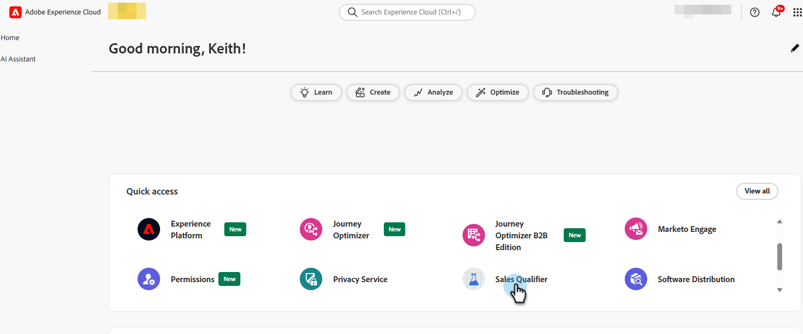
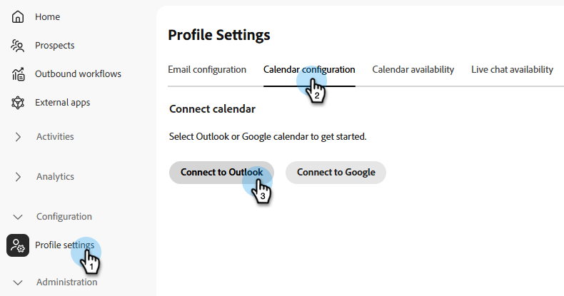
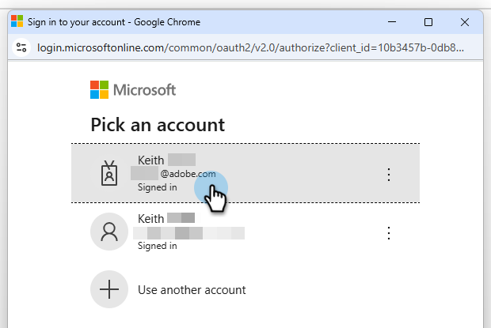
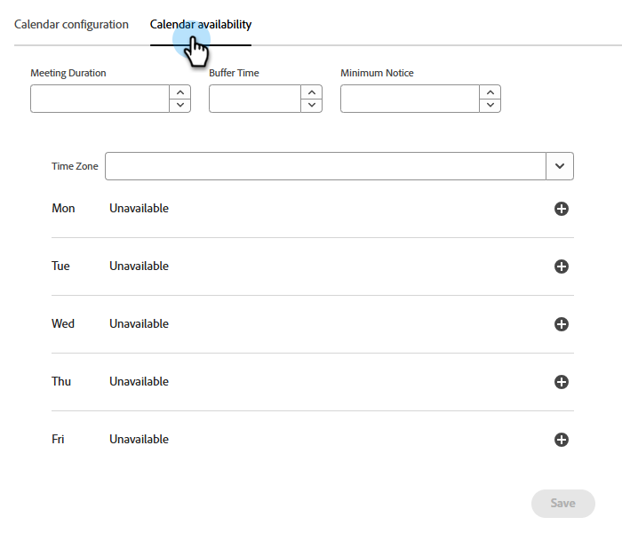
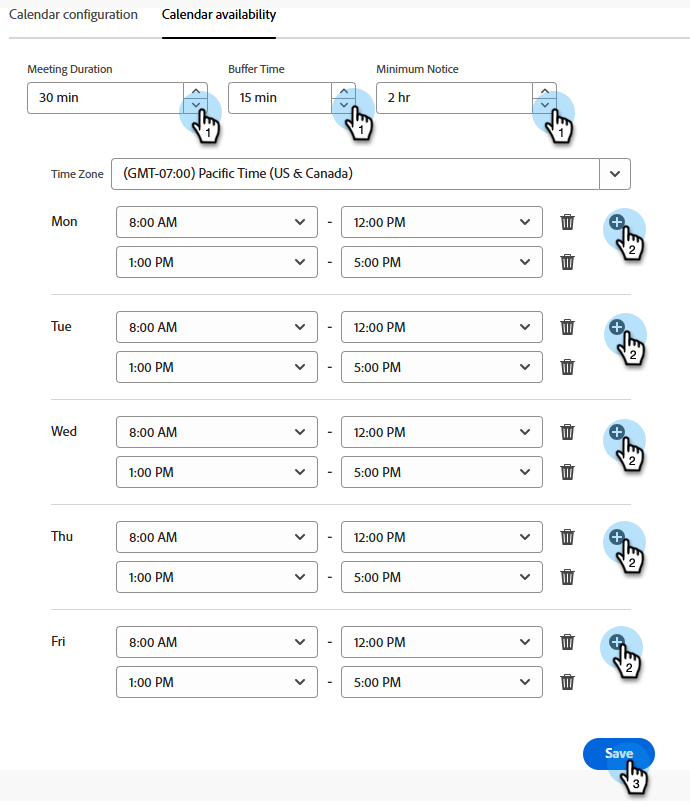
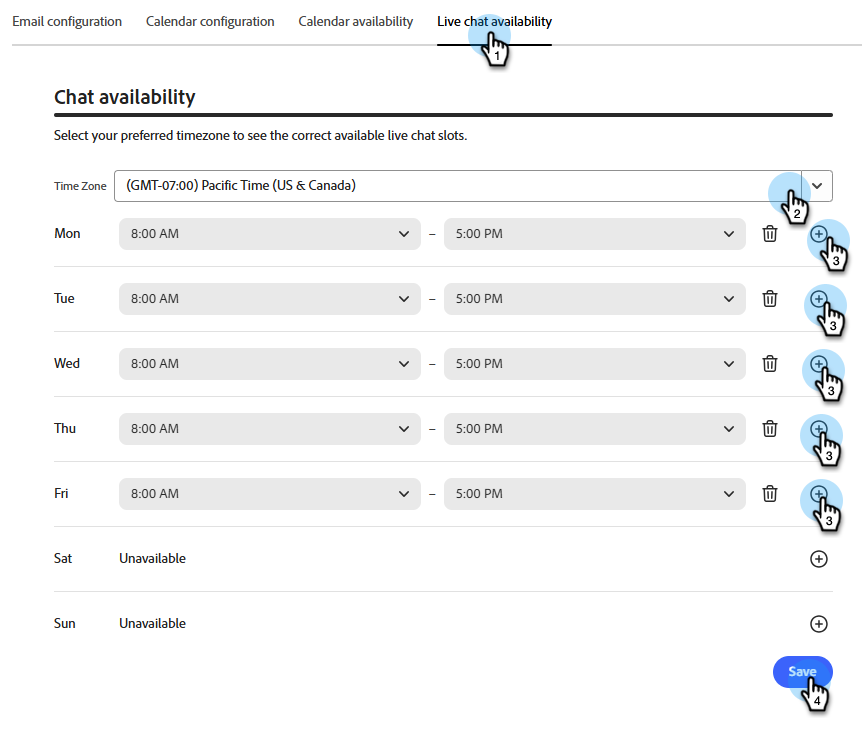
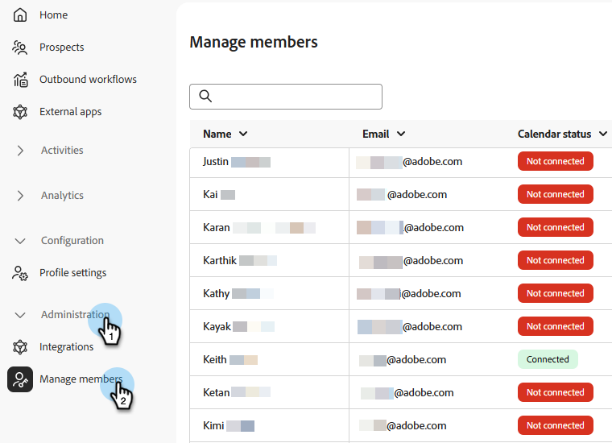

# 모임 {#meetings}

Adobe Brand Concierge에서 모든 _모임_ 설정을 알아봅니다. 달력을 연결하고 가용성을 설정하고 분석을 보는 등의 작업을 수행합니다.

>[!NOTE]
>
>[모임 예약](../getting-started/meeting-booking.md) 비디오도 볼 수 있습니다.

## 구성 {#configuration}

Outlook 또는 Google 계정에 연결하고 요일, 시간대 및 모임 기간과 같은 다양한 설정을 결정합니다.

### 캘린더 연결 {#connect}

1. [Adobe Experience Platform](https://experience.adobe.com/){target="_blank"}에 로그인합니다.

1. **[!UICONTROL 판매 한정자]**&#x200B;를 선택하십시오.

   {width="800" zoomable="yes"}

1. _구성_&#x200B;에서 **프로필 설정**&#x200B;을 클릭합니다. **[!UICONTROL 달력 구성]** 탭에서 원하는 달력을 선택합니다.

   

1. 이미 로그인한 계정을 선택하거나 새 계정을 추가합니다.

   

1. 연결이 완료되면 원하는 이메일 콘텐츠를 지정합니다.

   이것은 수신자가 귀하와의 회의를 예약할 때 전송되는 콘텐츠입니다. Microsoft Teams 모임 링크를 포함할 수도 있습니다(선택 사항).

   

1. **[!UICONTROL 저장]**&#x200B;을 클릭합니다.

### 일정 가용성 설정 {#calendar-availability}

1. **[!UICONTROL 일정 가용성]** 탭을 클릭합니다.

   

1. 원하는 설정을 선택합니다.

   >[!NOTE]
   >
   >시간 옵션을 추가하려면 더하기 기호()를 클릭하세요.

   

1. **[!UICONTROL 저장]**&#x200B;을 클릭합니다.

### 라이브 채팅 가용성 설정 {#chat-availability}

1. **[!UICONTROL 실시간 채팅 사용 가능]** 탭을 클릭하고 원하는 설정을 선택합니다. 완료되면 **저장**&#x200B;을 클릭합니다.

   

### 멤버 관리 {#manage}

**관리자만**. 담당자 중 누가 캘린더를 성공적으로 연결했는지 확인합니다.

## 활동 {#activities}

예약된 모임을 검토하고 캡처된 정보를 확인하고 모임이 예약된 시간을 알아보려면 **[!UICONTROL 모임 예약]**&#x200B;을 클릭하세요.

### 모임 페이지 {#bookings}

{width="800" zoomable="yes"}

## Analytics {#analytics}

**[!UICONTROL 모임 성과]**&#x200B;를 클릭하여 모임을 요청한 방문자 수와 누락된 방문자 수를 포함한 여러 분석 범주를 검토합니다. 모임의 트렌드가 어떠했는지, 누가 회의를 주재했는지 등을 알 수 있다.

### 모임 페이지 {#performance}

{width="800" zoomable="yes"}
